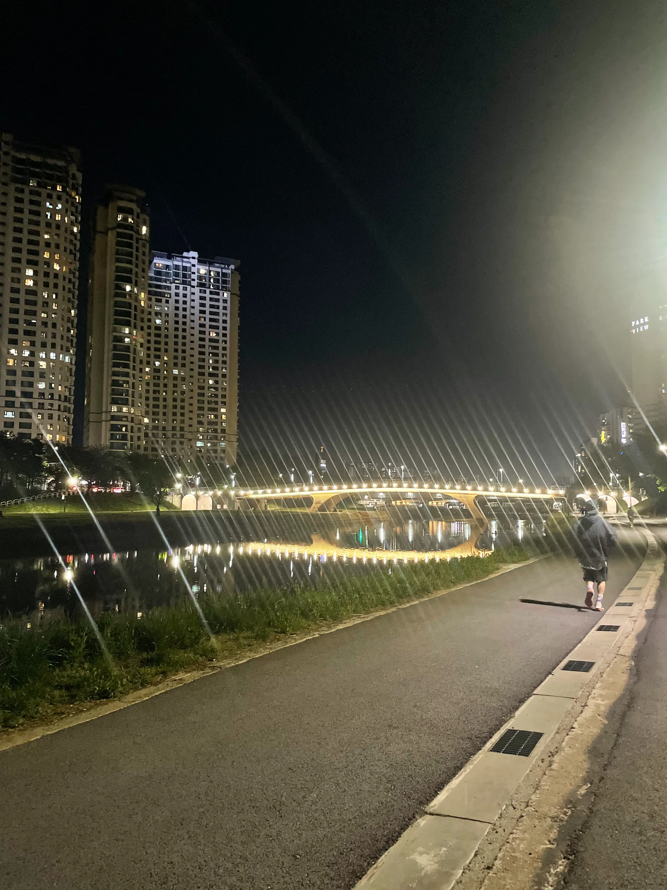
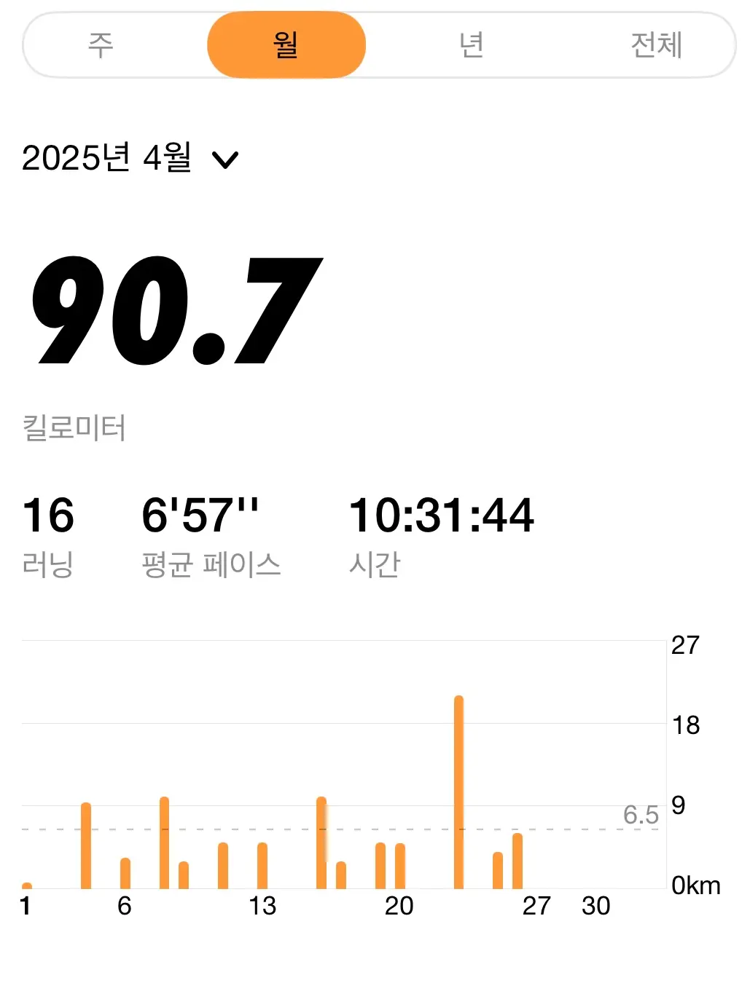
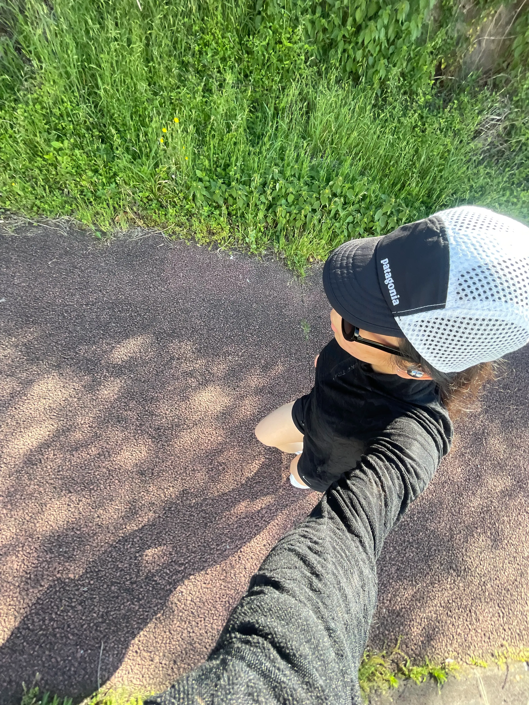

요즘은 러닝에 푹 빠졌다
겨울에는 너무 춥기도 하고 귀찮아서 달리질 못했는데 날씨 풀리니 너무 즐겁다
달리기가 즐겁다!

트랙 돌며 러닝하는 것도 좋지만 낮에 탄천 풍경 보며 달리는 게 제일 좋다
윤슬보며 달리면 기분이 정말 째진다

피자집 알바 언니오빠들과 같이 러닝하며 러닝에 더더욱 빠져버렸다
덕분에 더 재밌게 러닝하는 듯 하다

4월에는 10km 4번 달리는 게 목표였다
결과적으론 10km를 2번 달리고 21km(하프)를 1번 달렸는데 아무튼 총합 41km를 달렸으니 목표 달성 아닐까? 히히
90.7km를 달렸다

5km도 달릴 수 있을까 걱정하던 내가 지금은 10km, 21km도 달린다
이제 3km는 가뿐하고 5km는 일상으로 달린다
자주 뛰어 몸이 풀리니 3, 5km는 가뿐하다

몸도 마음도 건강해지는 러닝 너무 재밌다

4월에는 10km 4번 달리기가 목표였으니,
5월에는 10km 5번 달리기를 목표로 잡아야겠다

다들 러닝 같이 했음 좋겠다

마무리는 제주도에서 달렸을 때의 사진으로!
