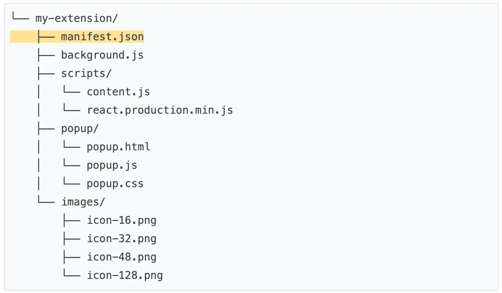
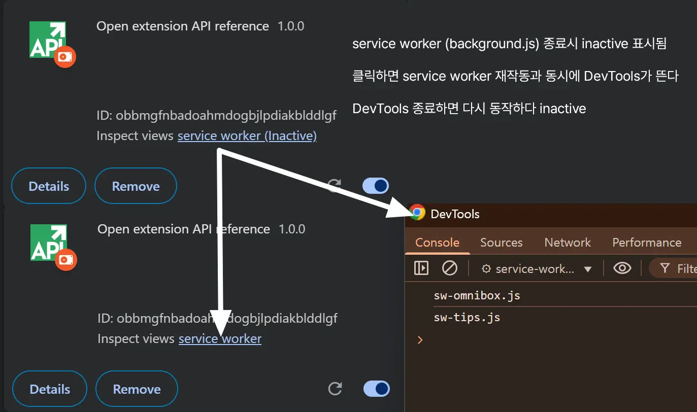

레퍼런스가 적은 관계로 공식 문서를 아주 꼼꼼히 봐야 개발 갈피가 잡힐 것 같다는 생각이 든다  
이번 글은 공식 문서를 살펴보겠다  
방식은 우선 한국어로 본 다음 영어로 명확하게 보기(영어부터 보면 너무 오래 걸린다)

참고한 공식 문서 : [chrome extension docs](https://developer.chrome.com/docs/extensions)


## 00 - Extension terminology(확장 용어 / 용어 정리)

확장 프로그램 개발하며 자주 나오는 용어이다

- manifest
- service workers
- content scripts
- toolbar action
- side panel
- DeclarativeNetRequest

## 01 - Get started(시작하기)

요약 : 기본 중 기본
### introduction
pass

### Hello World extension

[문서 링크](https://developer.chrome.com/docs/extensions/get-started/tutorial/hello-world)

요약 : 기본 알려줌

목표
- 'Hello World'와 같은 간단한 문구를 툴바에 출력해보는 확장 프로그램 만들기
- 툴바 아이콘 클릭 시 미리 적어둔 문구를 출력함

정리
- manifest.json
- 개발 중인 확장 프로그램 chrome에 로드하는 방법
- 개발 중 새로고침이 필요한 경우
- 콘솔 로그, 오류 찾기
- 확장 프로그램 프로젝트 구조


**⭐manifest.json : 확장 프로그램의 기능과 구성 설명하는 파일**
```json
{
  "name": "Hello Extensions", // 확장 프로그램 이름 
  "description": "Base Level Extension",
  "version": "1.0",
  "manifest_version": 3,
  "action": {
    "default_popup": "hello.html", // 팝업에 표시할 HTML 페이지
    "default_icon": "hello_extensions.png" // 아이콘 이미지
  }
}
```
여기서 `name`, `version`, `manifest_version`은 필수  
프로젝트의 루트에 있어야 한다  
개발 중 주석(//) 지원, Chrome 웹 스토어에 업로드하기 전에는 주석 삭제해야 함

<details>
<summary>개발 중인 확장 프로그램 chrome에 로드하는 방법</summary>
<div markdown="1">
1. chrome://extensions 접속 (혹은 퍼즐 모양 버튼 클릭 후 확장 프로그램 관리 선택)
2. developer mode(개발자 모드) on
3. Load unpacked(압축해제된 디렉터리 로드)
</div>
</details>

<details>
<summary>개발 중 새로고침이 필요한 경우</summary>
<div markdown="1">
새로고침(reload)은 확장 프로그램 관리 페이지에 새로고침 버튼을 누르면 된다

| 확장 프로그램 구성요소            | 확장 프로그램 새로고침 필요 |
| ----------------------- | :-------------- |
| manifest                | 예               |
| service worker 서비스 워커   | 예               |
| content script 콘텐츠 스크립트 | 예 (호스트 페이지 포함)  |
| popup 팝업                | 아니요             |
| option page 옵션 페이지      | 아니요             |
| 기타 확장 프로그램 HTML 페이지     | 아니요             |

</div>
</details>


**콘솔 로그, 오류 찾기**  

**콘솔 로그**  
팝업 같은 경우 html임. 팝업 눌러 나온 html 오른쪽 마우스 클릭하여 검사(inspect)로 이동하면 콘솔 나옴

**오류 찾기**  
오류 발생 시 확장 프로그램 관리 페이지에 Errors(오류) 버튼 표시됨
클릭하여 확인 가능


**확장 프로그램 프로젝트 구조**  
기본 구조는 다음과 같다  
<span style="background-color:#fff5b1">❗manifest.json 파일은 반드시 루트 디렉터리에 배치한다❗</span>



## 02 - Run scripts on every page(모든 페이지에서 스크립트 실행)

[문서 링크](https://developer.chrome.com/docs/extensions/get-started/tutorial/scripts-on-every-tab)

요약 : 스크립트 넣는 방법 알려줌

아이콘은 크기 별로 필요(16x16, 32x32, 48x48, 128x128)  
`images/` 폴더에 넣어 정리한다

**content_scripts : 확장 프로그램이 페이지 콘텐츠 읽고 수정하는 스크립트**
- 확장 프로그램이 웹사이트의 HTML 구조(DOM)에 접근해서 변경할 수 있게 도와주는 스크립트
- `manifest.json`에 코드를 추가하여 content script를 등록한다
	```json
	{
	  "content_scripts": [
	    {
	      "js": ["scripts/content.js"], // 넣을 스크립트
	      "matches": [
	        "https://developer.chrome.com/docs/extensions/*",
	        "https://developer.chrome.com/docs/webstore/*"
	      ] // match pattern (<scheme>://<host><path> 세 부분으로 구성, '*'문자 포함 가능)
	    }
	  ]
	}
	```

<details>
<summary>참고 : 해당 가이드에서 사용된 content.js 코드</summary>
<div markdown="1">
```javascript
// DOM (Document Object Model, 문서 객체 모델 사용)
// 페이지에 article 요소가 있는지 확인 후 이 안의 모든 단어를 계산하여 총 읽기 시간 표시

const article = document.querySelector("article");

// `document.querySelector` may return null if the selector doesn't match anything.
if (article) {
  const text = article.textContent;
  const wordMatchRegExp = /[^\s]+/g; // Regular expression
  const words = text.matchAll(wordMatchRegExp);
  // matchAll returns an iterator, convert to array to get word count
  const wordCount = [...words].length;
  const readingTime = Math.round(wordCount / 200);
  const badge = document.createElement("p");
  // Use the same styling as the publish information in an article's header
  badge.classList.add("color-secondary-text", "type--caption");
  badge.textContent = `⏱️ ${readingTime} min read`;

  // Support for API reference docs
  const heading = article.querySelector("h1");
  // Support for article docs with date
  const date = article.querySelector("time")?.parentNode;

  (date ?? heading).insertAdjacentElement("afterend", badge);
}
```
</div>
</details>

## 03 - Inject scripts into the active tab(활성 탭(현재 탭)에 스크립트 삽입)

[문서 링크](https://developer.chrome.com/docs/extensions/get-started/tutorial/scripts-activetab)


요약 : service worker = 백그라운드 스크립트 / 지금 보는 웹페이지에 만든 js 코드 실행하는 방법 / background.js(확장 프로그램 한정) VS content.js (현재 있는 페이지(활성 페이지))

- 단축키 사용
- 확장 프로그램 아이콘 클릭
- Scripting API 사용
- `activeTab`권한 통해 사용자 개인 정보 보호
- chrome.action API


**service worker(서비스 워커) : 백그라운드 브라우저 이벤트(탭 열릴 때 감지, 알람 울리기, 사용자가 extension 아이콘 클릭했을 때 이벤트 받기 등)를 모니터링하는 스크립트**
- 이벤트를 처리하고 필요하지 않을 때는 종료되는 js 환경
- extension service worker는 extension의 중앙 이벤트 핸들러(central event handler)
- DOM에 접근할 수 없다
- 표준 서비스 워커 이벤트(standard service worker event) + 새 페이지 탐색, 알림 클릭, 탭 닫기 등(확장 이벤트(extension event))에 응답
- 백그라운드에서 돌아가는 스크립트이므로 화면x
- manifest.json에 등록하는 형태 예시
	```json
	{
		...
		"background": {
			"service_worker": "background.js"
		},
	}
	```

<details>
<summary>web service worker?</summary>
<div markdown="1">
web service worker와 좀 다른가 봄
찾아보니 원래 웹에서의 service worker는 아래와 같음
1. 오프라인 상태에서 동작
2. 푸시 알림
3. 백그라운드 작업 등을 처리할 때 사용
예시로는 Gmail 웹앱이 닫혀 있을 때 새 메일 알림 띄우는 서비스는 web service worker가 하는 것
</div>
</details>


manifest.json
```json
{
	// name, manifest_version, version은 필수
	"name": "Focus Mode",
	"manifest_version": 3,
	"version": "1.0",
	"description": "Enable focus mode on Chrome's official Extensions and Chrome Web Store documentation.",
	"icons": {
	    "16": "images/icon-16.png",
	    "32": "images/icon-32.png",
	    "48": "images/icon-48.png",
	    "128": "images/icon-128.png"
	},
	// background - service worker - background script
	"background": {
		"service_worker": "background.js"
	},
	// action - control toolbar icon
	"action": {
		"default_icon": {
	      "16": "images/icon-16.png",
	      "32": "images/icon-32.png",
	      "48": "images/icon-48.png",
	      "128": "images/icon-128.png"
	    }
    },
    "permissions": ["activeTab", "scripting"], // 권한 배열, scripting은 style sheet insert or remove를 위해 넣음(Scripting API 사용)
    
    
    "commands": {
	    "_execute_action": { // action.onClicked()와 같은 효과 발생
		    "suggested_key": {
			    "default": "Ctrl+B",
			    "mac": "Command+B"
		    }
	    }
    }
}
```


background.js
```javascript

// runtime.onInstalled() : extension 초기 상태 설정, 설치시 일부 작업 완료
// storage API나 IndexedDB 사용하여 application state 저장 가능
// 여기서는 단순 2가지('ON', 'OFF')만 처리하므로 action's badge text 사용
// *action's badge* : 
chrome.runtime.onInstalled.addListener(() => {
	// chrome.action API : 툴바의 extension 아이콘 제어하는 API
	// badge text는 아이콘에 작게 표시되는 텍스트로 4개 이하 문자(char) 사용 권고
	chrome.action.setBadgeText({
		text: "OFF",
	});
});

// url과 문서 페이지 일치 확인 후 상태 바꾸는 코드
const extensions = 'https://developer.chrome.com/docs/extensions';
const webstore = 'https://developer.chrome.com/docs/webstore';

chrome.action.onClicked.addListener(async (tab) => {
	if(tab.url.startsWith(extensions) || tab.url.startsWith(webstore)){
		// Retrieve the action badge to check if the extension is 'ON' or 'OFF'
		const prevState = await chrome.action.getBadgeText({tabId: tab.id});
		// Next state will always be the opposite
		const nextState = prevState === 'ON' ? 'OFF' : 'ON';

		// Set the action badge to the next state
		await chrome.action.setBadgeText({
			tabId: tab.id,
			text: nextState,
		});
	}
	if (nextState === "ON"){
		// Insert the CSS file when the user turns the extension on
		await chrome.scripting.insertCSS({
			files: ["focus-mode.css"],
			target: { tab.id: tab.id },
		})
	} else if (nextState === "OFF"){
		// Remove the CSS file when the user turns the extension off
		await chrome.scripting.removeCSS({
			files: ["focus-mode.css"],
			target: { tabId: tab.id },
		});
	}
});
```

- [chrome.action API](https://developer.chrome.com/docs/extensions/reference/api/action)

ScriptingAPI를 통해 스타일 시트를 삽입/제거
chrome.scripting.insertCSS로 css 스타일시트를 넣을 수도 있지만 동일한 효과를scripting.executeScript()를 통해 js 코드로 넣을 수 있다


```css
*{
	display: none !important;
}

html,
body,
*:has(article),
article,
article *{
	display: revert !important;
}

[role='navigation']{
	display: none !important;
}

article {
	margin: auto;
	max-width: 700px;
}
```


## 04 - Handle events with service workers(서비스 워커로 이벤트 처리)


[문서 링크](https://developer.chrome.com/docs/extensions/get-started/tutorial/service-worker-events)

service workder 개념을 다루는 튜토리얼 문서

chrome extension에서 ES Module 사용을 위해 manifest.json에 사용하고자 하는 js 파일의 type을 module로 명시한다  
-> 명시해준 js파일에서 module을 import하여 사용할 수 있게 된다

>**ES Module (ECMAScript Module)**  
>여러 개의 JS 파일을 나눠 쓰게 함
>필요한 기능만 불러올 수 있게 해줌
>
>코드를 파일 단위로 정리하여 유지보수가 편함, 필요한 것만 가져와 사용하는 방식으로 불필요한 코드를 최소화할 수 있음
>
>ex) export, import


<details>
<summary>service worker 디버깅 방법</summary>
<div markdown="1">
service worker의 로그, 언제 종료됐는지 확인하는 방법을 정리함


에러 발생 시 Errors라고 버튼 나옴  
누르면 확인 가능
</div>
</details>


<span style="background-color: #fff5b1">⭐service worker의 state 저장 방법⭐</span>

기본적으로 service worker는 수명이 짧다
chrome extension의 service worker는 필요하지 않으면 실행이 중단된다
service worker는 window 객체에 접근 불가하므로 window.localStorage를 이용한 값 저장 불가함
반복적으로 종료되기 때문에 글로벌 변수 또한 사용이 어려움

따라서 service worker에 state 저장을 위해 chrome.storage.local을 사용한다
(chrome.storage API 이용 / manifest.json에 "permission" : \["storage"\]를 추가한다)

참고로 chrome.storage.local은 웹 캐시 삭제 시에도 유지함


**이벤트 등록하기**
- event listener(이벤트 리스너)는 서비스 워커가 다시 시작돼도 살아있어야 하기 때문에 **전역 위치(global scope)**에 등록되어야 한다
- 리스너를 함수 안에 넣으면 크롬이 재등록 못함


서비스 워커는 web API, Chrome API 모두 사용 가능(몇 가지 예외가 있다)


**set up a recurring event(반복 이벤트 설정)**

setTimeout()이나 setInterval()은 서비스워커가 종료되면 스케쥴러가 취소시킴
서비스워커 주기에 맞춰 같이 삭제된다
따라서 구글 확장 프로그램에서는 `chrome.alarms API`를 이용한다

chrome.alarms
- 정해진 주기마다 이벤트 발생시키기 가능
- 크롬이 꺼졌다 켜져도 다시 동작 가능하게 설정 가능

**오늘의 팁 popover api 이용해서 띄우기**  
**(content script <-> service worker 메시지 주고 받기)**

1. chrome api 문서 들어가면
2. content script 실행
3. service worker에게 '오늘의 팁 알려줘' 메시지 보냄
4. service worker가 저장된 팁 보내줌
5. content script가 팁을 받아 페이지에 버튼 + 팝오버 형태로 보여줌


**코드**
<details>
<summary>manifest.json</summary>
<div markdown="1">
```json
{

  "manifest_version": 3,

  "name": "Open extension API reference",

  "version": "1.0.0",

  "icons": {

    "16": "images/icon-16.png",

    "128": "images/icon-128.png"

  },

  "background": {

    "service_worker": "service-worker.js",

    "type": "module"

  },

  "permissions": ["storage", "alarms"],

  "host_permissions": ["https://chrome.dev/f/*"],

  "minimum_chrome_version": "102",

  "omnibox": {

    "keyword": "api"

  },

  "content_scripts": [

    {

      "matches": ["https://developer.chrome.com/docs/extensions/reference/*"],

      "js": ["content.js"]

    }

  ]

}
```
</div>
</details>

<details>
<summary>service-worker.js</summary>
<div markdown="1">
```javascript
import './sw-omnibox.js';
import './sw-tips.js';
```
</div>
</details>

<details>
<summary>sw-omnibox.js</summary>
<div markdown="1">
```javascript
console.log('sw-omnibox.js');

  

// save default API suggestions

// runtime.onInstalled() 이벤트 발생시 extension이 처음 설치될 때의 상태(state) 초기화 가능

  

chrome.runtime.onInstall.addListener(({ reason }) => {

  if (reason === 'install') {

    chrome.storage.local.set({

      apiSuggestions: ['tabs', 'storage', 'scripting'],

    });

  }

});

  

const URL_CHROME_EXTENSIONS_DOC =

  'https://developer.chrome.com/docs/extensions/reference/';

const NUMBER_OF_PREVIOUS_SEARCHES = 4;

  

// Display the suggestions after user starts typing

chrome.omnibox.onInputChanged.addListener(async (input, suggest) => {

  // 기본 설명 문구

  await chrome.omnibox.setDefaultSuggestion({

    description: 'Enter a Chrome API or choose from past searches',

  });

  // 저장소에서 이전 검색어 불러오기

  const { apiSuggestions } = await chrome.storage.local.get('apiSuggestions');

  

  // 검색어 하나하나 꺼내어 목록 전환

  const suggestions = apiSuggestions.map((api) => {

    return { content: api, description: 'Open chrome.${api} API' };

  });

  // 추천 목록을 주소창에 표시한다

  suggest(suggestions);

});

  

// Open the reference page of the chosen API

chrome.omnibox.onInputEntered.addListener((input) => {

  // 새로운 탭 열고 선택한 chrome API 문서 페이지로 이동

  chrome.tabs.create({ url: URL_CHROME_EXTENSIONS_DOC + input });

  // Save the latest keyword

  updateHistory(input);

});

  

async function updateHistory(input) {

  const { apiSuggestions } = await chrome.storage.local.get('apiSuggestions');

  apiSuggestions.unshift(input); // 새 검색어 앞에 추가

  apiSuggestions.splice(NUMBER_OF_PREVIOUS_SEARCHES); // 최대 4개까지 저장

  return chrome.storage.local.set({ apiSuggestions });

}
```
</div>
</details>

<details>
<summary>sw-tips.js</summary>
<div markdown="1">
```javascript
console.log('sw-tips.js');

  

// Fetch tip & save in storage

const updateTip = async () => {

  const response = await fetch('https://chrome.dev/f/extension_tips');

  const tips = await response.json();

  const randomIndex = Math.floor(Math.random() * tips.length);

  return chrome.storage.local.set({ tip: tips[randomIndex] });

};

  

const ALARM_NAME = 'tip';

  

// check if alarm exist to avoid resetting the timer.

// The alarm might be removed when the browser session restart

async function createAlarm() {

  const alarm = await chrome.alarms.get(ALARM_NAME);

  if (typeof alarm === 'undefined') {

    // 크롬 매번 시작할 때 체크해서 없으면 다시 만들기

    chrome.alarm.create(ALARM_NAME, {

      delayInMinutes: 1, // 첫 실행은 1분 뒤뒤

      periodInMinutes: 1440, // 하루마다 실행 (1440m = 24h)

    });

    updateTip(); // 팁 갱신

  }

}

  

createAlarm();

  

// Update tip once a day

// 알람이 울릴 때마다(onAlarm) updateTip() 함수를 실행해 팁을 새로 받아 저장

chrome.alarms.onAlarm.addListener(updateTip);

  

// Send tip to content script via messaging

// content script에서 온 메시지 응답 처리하는 리스너

chrome.runtime.onMessage.addListener((message, sender, sendResponse) => {

  if (message.greeting === 'tip') {

    chrome.storage.local.get('tip').then(sendResponse);

    return true; // sendMessage를 비동기로 쓰겠다는 의미로 반드시 필요함

  }

});
```
</div>
</details>

<details>
<summary>content.js</summary>
<div markdown="1">
```javascript
(async () => {

  // Sends a message to the service worker and receives a tip in response

  // 서비스워커에게 오늘의 팁 달라고 요청 후 tip에 응답 받아옴

  const { tip } = await chrome.runtime.sendMessage({ greeting: 'tip' });

  

  const nav = document.querySelector('.upper-tabs > nav');

  

  // 팁 팝오버 띄우는 버튼

  const tipWidget = createDomElement(`

    <button type="button" popovertarget="tip-popover" popovertargetaction="show" style="padding: 0 12px; height: 36px;">

        <span style="display:block; font: var(--devsite-link-font,500 14px/20px var(--devsite-primary-font-family));">Tip</span>

    </button>

    `);

  

  // Popover API (HTML5에 추가됨. 팝업 띄우는 기능)

  const popover = createDomElement(

    `<div id='tip-popover' popover style="margin: auto;">${tip}</div>`

  );

  

  document.body.append(popover);

  nav.append(tipWidget);

})();

  

// HTML 문자열을 실제 DOM 요소로 바꾸는 함수수

function createDomElement(html) {

  const dom = new DOMParser().parseFromString(html, 'text/html');

  return dom.body.firstElementChild;

}
```
</div>
</details>


